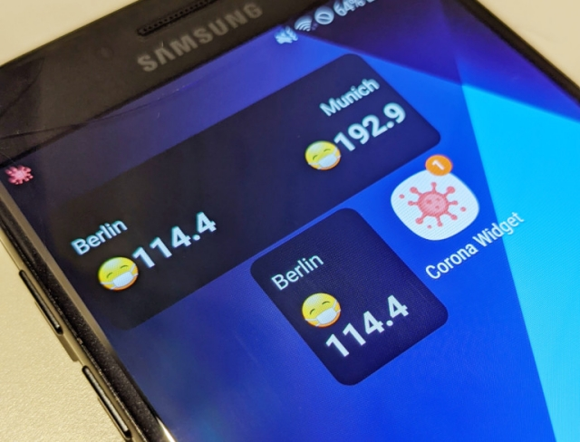
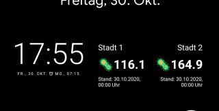
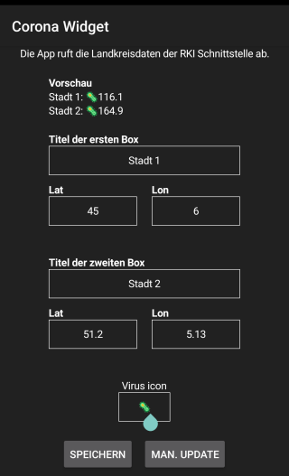

# 😷 Appcelerator Titanium Covid-19 widget for Android



<br/>
<span class="badge-buymeacoffee"><a href="https://www.buymeacoffee.com/miga" title="donate"></a></span>

<table>
<tr>
<td>
<br/>
<small><i>Widget</i></small>
</td>
<td>
<br/>
<small><i>Widget selection</i></small>
</td>

<td>
<br/>
<small><i>App settings</i></small>
</td>
</tr>
</table>

<hr/>

## 📋 Content

<i><b>This Widget and app started as a proof-of-concept how to create such a widget with Appcelerator Titanium! It is not a final app (yet) 😉 It works but it can be improved!</b></i>

* 📱 Appcelerator Titanum app (<a href="/app">app folder</a>)
* 📱 Appcelerator Titanum Android Widget (<a href="/widget">widget folder</a>)

The widget is a basic Android Home widget that will read Ti.App.Properties and writes them into XML fields. The app will run a foreground service (the icon in the top left corner) and collects data every 30mins. This data is forwarded to the widget.

## 📲 How to install the app

You can install it from here:


<br/>
Scan the QR code or go to the <a href="https://github.com/m1ga/ti.coronawidget/releases/">release section</a>. Then click on the latest release and download the APK (under assets)

* download APK
* install APK
* add the Widget to your home screen
* start the app
* set places and press "Force update"

**Note**
_No F-Droid version yet._

## Known issues

There are still some bugs and features that could be implemented:
* if the icon is gone you have to restart the app to get new updates. Sometimes the system will kill the background process

## 🛠 Build

The App is created with <a href="https://www.appcelerator.com/mobile-app-development-products/">Appcelerator Titanium</a>. In order to build the app you will need to install the toolchain first. Have a look at my <a href="https://github.com/m1ga/from_zero_to_app/blob/master/installation.md">installation tutorial</a> from <a href="https://github.com/m1ga/from_zero_to_app">From zero to app</a> or at the official <a href="https://www.appcelerator.com/">Appcelerator</a> page.

### Widget

go to the `widget/android/` folder and run
```appc ti build -p android --build-only```

### App

go to the `app/` folder and run
```bash
appc new --import --no-services
appc ti build -p android
```

## 🚨 Attention
_Android only!_ For iOS you can use Scriptable with https://gist.github.com/kevinkub/46caebfebc7e26be63403a7f0587f664 by @kevinkub (https://github.com/kevinkub)


## Author
* Michael Gangolf (https://migaweb.de) <span class="badge-buymeacoffee"><a href="https://www.buymeacoffee.com/miga" title="donate"></a></span>
